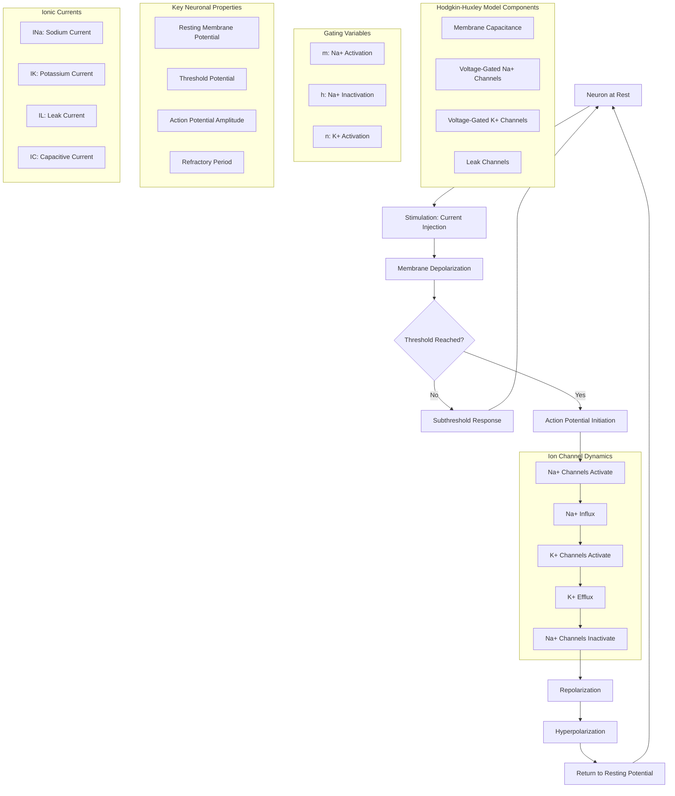

Neuronal Model Simulation with the Hodgkin-Huxley Model

## Introduction

This project simulates the changes in the membrane potential of a neuron using the Hodgkin-Huxley (HH) model. The HH model is fundamental in understanding how neurons generate and propagate electrical signals called action potentials. This README will explain how neurons work, detail every formula used in the code, and provide insights into the purpose of each calculation.

## How Neurons Work

Neurons are the basic building blocks of the nervous system. They communicate with each other through electrical impulses known as action potentials. These action potentials are generated by the movement of ions (charged particles) across the neuron's cell membrane through specialized proteins called ion channels.

- **Membrane Potential (V):** The electrical potential difference across the neuron's membrane. 

- **Ion Channels:** Proteins that allow ions to pass in and out of the neuron, influencing the membrane potential.

- **Action Potential:** A rapid rise and fall in membrane potential that travels along the neuron, allowing it to communicate with other neurons.

## Sodium and Potassium Channels

### What Are Ion Channels?

Ion channels are specialized proteins embedded in the cell membrane that allow ions to move in and out of the neuron. These channels are crucial for the generation and propagation of action potentials. The primary ion channels involved in this process are sodium (Na⁺) and potassium (K⁺) channels.

### Sodium (Na⁺) Channels

Sodium channels are responsible for the rapid depolarization phase of the action potential. When these channels open, Na⁺ ions rush into the neuron, causing the membrane potential to become more positive. Sodium channels have two gates—an activation gate (m) and an inactivation gate (h). The activation gate opens in response to a depolarizing stimulus, allowing Na⁺ ions to enter. Shortly after, the inactivation gate closes, stopping the flow of Na⁺ ions. The influx of Na⁺ ions causes the membrane potential to spike, which is the rising phase of the action potential. This rapid depolarization is essential for the propagation of the electrical signal along the neuron.

### Potassium (K⁺) Channels

Potassium channels are responsible for repolarizing the membrane after the action potential has passed. When these channels open, K⁺ ions flow out of the neuron, returning the membrane potential to a more negative value. Potassium channels open more slowly than sodium channels in response to depolarization. This delayed opening allows them to counteract the depolarization caused by Na⁺ influx. The efflux of K⁺ ions helps to repolarize the membrane, bringing the membrane potential back down after the spike. This is known as the falling phase of the action potential.

## Hodgkin-Huxley Model

The Hodgkin-Huxley model provides a mathematical description of how action potentials in neurons are initiated and propagated. This model uses several equations to represent the behavior of ion channels and the changes in membrane potential. The Hodgkin-Huxley model has a couple of key components:

1. **Membrane Capacitance (C):** Represents the ability of the membrane to store charge.
2. **Ion Conductances (G):** Represent how easily ions can pass through their respective channels.
3. **Reversal Potentials (E):** The membrane potential at which there is no net flow of specific ions.

## HH Model Equations

[coming soon]

## Conclusion

This simulation provides a basic introduction to the Hodgkin-Huxley model and how neurons generate electrical signals. By understanding these calculations and their significance, you can gain insight into the fundamental processes of neuronal communication and how computational models can help study them.